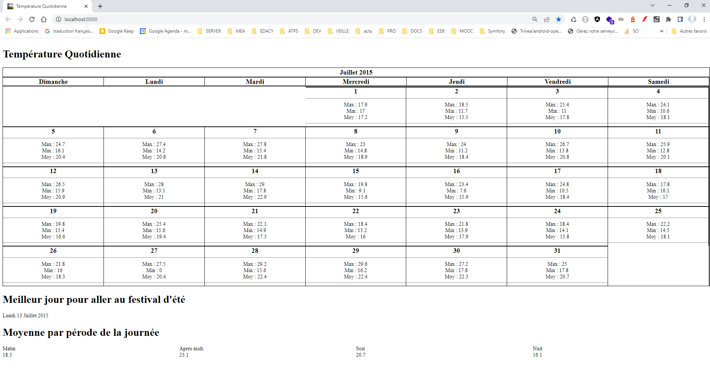
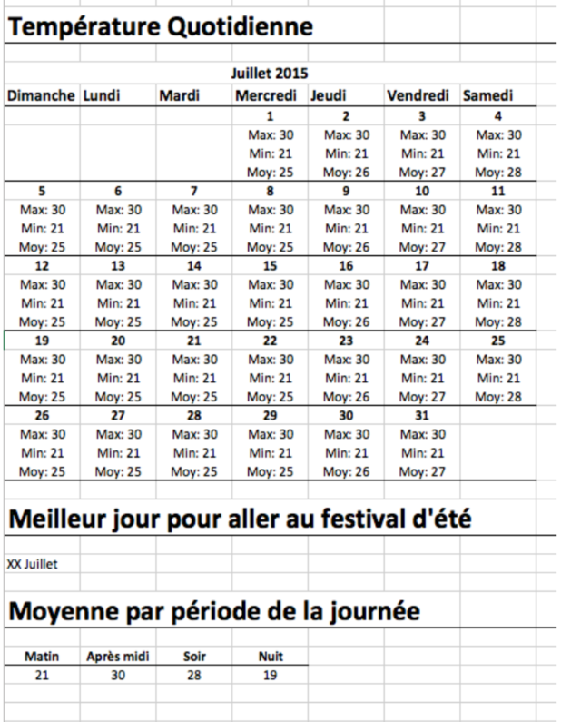

# app_weather

# Objectif

**Charger** et **analyser** les données de température du mois de juillet 2015 à Québec en langage PHP et les afficher
sous format HTML.

À partir du fichier XML (eng-hourly-07012015-07312015.xml) contenant les données de température horaire du mois de
juillet 2015.

# Structure du code
<pre>
.
├── cache                       # Dossiers des caches        
├── src                         # Dossiers des sources Service ,Entity et Extensions Twig 
│   ├── Entity                  # Dossiers contenants les Entites 
│   ├── Extension               # Dossiers contenants les Extensions (twig) 
│   └── Service                 # Dossiers contenants les Services 
├── tests                       # Dossiers des tests unitaires et integrations
│   ├── Acceptance              # Tests d'integrations
│   ├── Services                # Tests unitaires des services
│   └── DotEnv                  # Tests unitaires de DotEnv .env (chargement fichier de parametres)
├── uplaods                     # Dossiers contenants les fichiers XML etc..
├── views                       # Dossiers des views  
│   ├── weather.html.twig       # View principale incluant les autres templates
│   ├── inc_calendar.html.twig  # View de la partie calendrier : Température Quotidienne
│   ├── inc_best_day.html.twig  # View de la partie Meilleur jour pour aller au festival d'été
│   └── inc_avg_day.html.twig   # View de la partie Moyenne par pérode de la journée
├── web                         # Point d'entree du projet
├── composer.json               # Fichier contenant les dependances  du projet
├── Procfile                    # Fichier de deploiement du cloud heroku
├── HELP.md                     # Fichier contenant le reference des dependances utilisees 
├── README.md                   # Fichier contenant la documentation du projet
└── .env                        # Fichier de configuration des parametres du projet
</pre>

# Solutions 

## Question : 1
    Afficher le **maximum**, **minimum** et **moyenne** de la température **quotidienne** sous format calendrier.

### 

    DataAnalyseService 
      +getListModelAnalysed()

## Question : 2
    Trouver et expliquer (dans un commentaire) le meilleur jour pour assister à un spectacle
    musical extérieur en soirée durant le festival d’été qui s’est déroulé du 9 au 19 juillet

### 

    DataAnalyseService
        +getBestDaySummerEvent()

## Question : 3
    Afficher la moyenne de température par période (matin, après midi, soir, nuit) de la
    journée pour l’ensemble du mois de juillet.

### 

    DataAnalyseService
        +getAvgTempByPeriod()

# INSTALLATION

## Pré-requis
    PHP 7.2.5 ou plus.
    Composer 2 
## installer les dependences

    composer install
    cp .env.dist .env

## Lancer les tests unitaires
    composer tests

## Lancer les tests d' interations
    composer interation_test

## Lancer le projet
    composer start

## Lien publique pour tester (heroku)

[https://cnd-app-weather.herokuapp.com/](https://cnd-app-weather.herokuapp.com/)

## References 

### Resultat final  :

### Resultat attendu :

